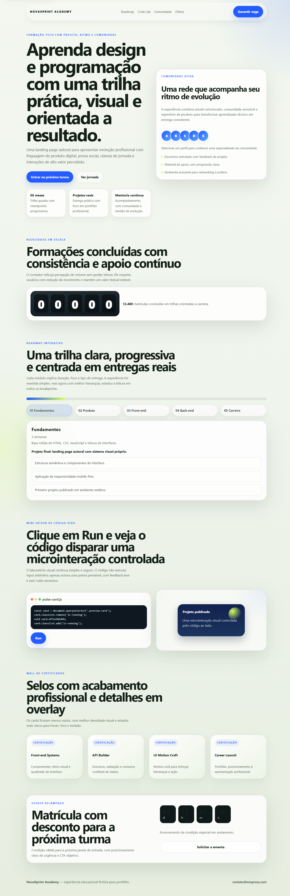

# NovaSprint Academy

> Landing page conceitual de uma escola tech fictícia, desenhada para transmitir evolução profissional com visual premium, narrativa clara e interações sutis.

## Preview




## Sobre o Projeto

O projeto apresenta uma página de divulgação para uma formação tech fictícia, com foco em posicionamento visual, hierarquia de informação, prova social e experiência responsiva. A proposta é demonstrar domínio de front-end estático com HTML, CSS e JavaScript vanilla, sem depender de frameworks para entregar acabamento profissional.

O refinamento atual preserva a identidade original da landing page, mas eleva a qualidade em quatro frentes:

- consistência visual entre hero, cards, seções e CTA final;
- melhoria de acessibilidade e navegação por teclado;
- fluxo mínimo de `dev` e `build` para ambiente profissional;
- documentação pronta para portfólio e deploy na Vercel.

## Contexto do Projeto

```text
Framework/Stack atual: HTML5 + CSS3 + JavaScript Vanilla + Node.js para scripts locais
Gerenciador de pacotes: npm
Build tool: Script estático customizado em Node.js
Repositório atual: Landing page estática com entrada em index.html e assets em src/
Páginas/seções existentes: Hero, comunidade, contador, roadmap, code lab, certificados, oferta e footer
```

## Tecnologias Utilizadas

- [HTML5](https://developer.mozilla.org/pt-BR/docs/Web/HTML) — Estrutura semântica da interface
- [CSS3](https://developer.mozilla.org/pt-BR/docs/Web/CSS) — Sistema visual, responsividade e microinterações
- [JavaScript](https://developer.mozilla.org/pt-BR/docs/Web/JavaScript) — Interações, modal, countdown e roadmap
- [Node.js](https://nodejs.org/) — Scripts locais de servidor e build
- [Vercel](https://vercel.com/) — Deploy estático do projeto

## Funcionalidades

- [x] Hero com hierarquia visual refinada e CTAs claros
- [x] Card de comunidade com feedback contextual para mouse e teclado
- [x] Contador animado com fallback para usuários com redução de movimento
- [x] Roadmap interativo com detalhe dinâmico por módulo
- [x] Mini editor com prévia controlada e feedback em tempo real
- [x] Wall de certificados com modal acessível
- [x] Countdown de oferta com estado final de urgência
- [x] Layout responsivo para mobile, tablet e desktop
- [x] Foco visível, landmarks semânticos e suporte a teclado
- [x] Build estático pronto para deploy na Vercel

## Decisões de UI/UX

- A paleta original verde-azul foi preservada, mas com tokens mais consistentes para superfícies, bordas e sombras.
- As animações foram reduzidas ao que realmente agrega leitura e resposta de interface.
- O layout continua leve e autoral, sem migrar para um template genérico ou para uma arquitetura mais pesada do que o projeto precisa.
- O header ganhou comportamento sticky discreto para melhorar navegação sem poluir a experiência.

## Acessibilidade

O projeto adota melhorias básicas e úteis de WCAG:

- skip link para acesso rápido ao conteúdo principal;
- foco visível em links, botões e controles;
- navegação por teclado no roadmap e no modal;
- retorno de foco após fechar o modal;
- regiões dinâmicas com `aria-live`;
- suporte a `prefers-reduced-motion`;
- contraste reforçado em textos e superfícies principais.

## Estrutura de Pastas

```text
.
├── docs/
│   ├── desktop.png
│   ├── mobile.png
│   └── superpowers/
│       ├── plans/
│       └── specs/
├── index.html
├── package.json
├── scripts/
│   ├── build.mjs
│   └── dev.mjs
├── src/
│   ├── assets/
│   │   └── favicon.svg
│   ├── scripts/
│   │   └── main.js
│   └── styles/
│       └── main.css
└── vercel.json
```

## Como Rodar Localmente

```bash
# Clone o repositório
git clone https://github.com/usuario/novasprint-academy.git
cd novasprint-academy

# Instale dependências
npm install

# Inicie o servidor local
npm run dev

# Acesse no navegador
http://localhost:3000
```

## Build de Produção

```bash
# Gere a versão estática para deploy
npm run build

# Pré-visualize a pasta dist
npm run preview
```

O build gera a saída estática em `dist/`, que é o diretório configurado para publicação na Vercel.

## Deploy na Vercel

1. Conecte o repositório à Vercel.
2. Mantenha o comando de build como `npm run build`.
3. Use `dist` como diretório de saída.
4. Faça o deploy normalmente como projeto estático.

O arquivo [`vercel.json`](./vercel.json) já deixa esse fluxo explícito.

## Scripts Disponíveis

- `npm run dev` — serve o projeto localmente em `http://localhost:3000`
- `npm run build` — gera a saída estática em `dist/`
- `npm run preview` — serve a pasta `dist/` localmente

## Melhorias Futuras

- [ ] Adicionar analytics privativo com consentimento e sem poluição visual
- [ ] Criar uma seção extra de depoimentos ou cases com conteúdo fictício mais rico
- [ ] Extrair conteúdo textual para uma camada simples de dados, facilitando manutenção

## Autor

Desenvolvido por `Seu Nome`, como projeto de portfólio com dados genéricos e foco em apresentação profissional.

## Licença

Este projeto está sob a licença MIT.
